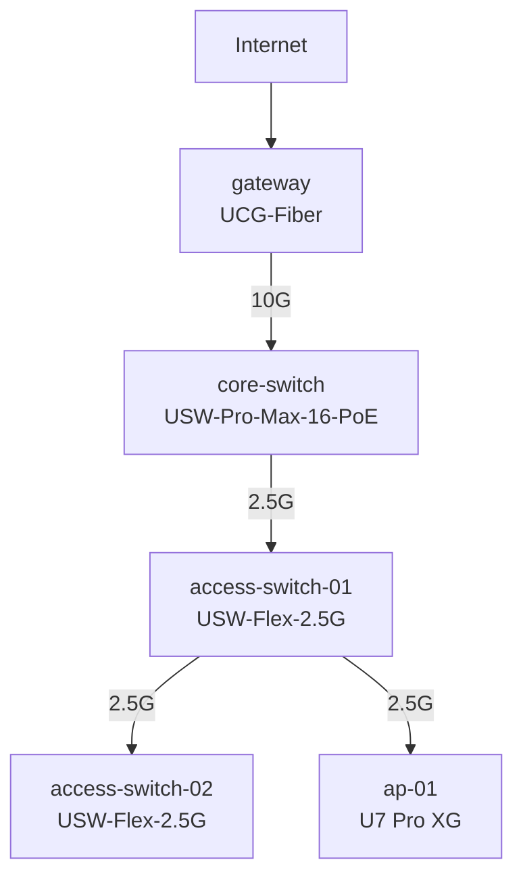
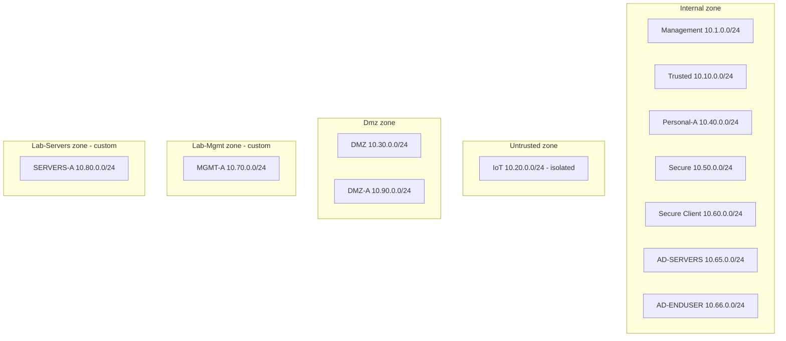
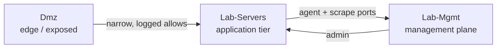
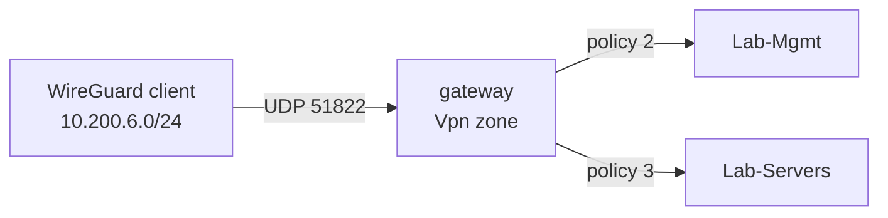

# Diagrams

The Mermaid source for the views used across the chapters. GitHub renders these inline.

## Physical topology

```mermaid
flowchart TD
    NET["Internet"]
    GW["gateway<br/>UCG-Fiber"]
    CORE["core-switch<br/>USW-Pro-Max-16-PoE"]
    A1["access-switch-01<br/>USW-Flex-2.5G"]
    A2["access-switch-02<br/>USW-Flex-2.5G"]
    AP["ap-01<br/>U7 Pro XG"]

    NET --> GW
    GW -->|10G| CORE
    CORE -->|2.5G| A1
    A1 -->|2.5G| A2
    A1 -->|2.5G| AP
```

## VLAN-to-zone map

```mermaid
flowchart TB
    subgraph INTERNAL["Internal zone"]
        V1["Management 10.1.0.0/24"]
        V10["Trusted 10.10.0.0/24"]
        V40["Personal-A 10.40.0.0/24"]
        V50["Secure 10.50.0.0/24"]
        V60["Secure Client 10.60.0.0/24"]
        V65["AD-SERVERS 10.65.0.0/24"]
        V66["AD-ENDUSER 10.66.0.0/24"]
    end
    subgraph UNTRUSTED["Untrusted zone"]
        V20["IoT 10.20.0.0/24 - isolated"]
    end
    subgraph DMZZONE["Dmz zone"]
        V30["DMZ 10.30.0.0/24"]
        V90["DMZ-A 10.90.0.0/24"]
    end
    subgraph LABMGMT["Lab-Mgmt zone - custom"]
        V70["MGMT-A 10.70.0.0/24"]
    end
    subgraph LABSRV["Lab-Servers zone - custom"]
        V80["SERVERS-A 10.80.0.0/24"]
    end
```

## Three-tier flow

```mermaid
flowchart LR
    EDGE["Dmz<br/>edge / exposed"]
    APP["Lab-Servers<br/>application tier"]
    MGMT["Lab-Mgmt<br/>management plane"]

    EDGE -->|"narrow, logged allows"| APP
    APP -->|"agent + scrape ports"| MGMT
    MGMT -->|"admin"| APP
```

## WireGuard access path

```mermaid
flowchart LR
    C["WireGuard client<br/>10.200.6.0/24"]
    GW["gateway<br/>Vpn zone"]
    M["Lab-Mgmt"]
    S["Lab-Servers"]

    C -->|"UDP 51822"| GW
    GW -->|"policy 2"| M
    GW -->|"policy 3"| S
```
